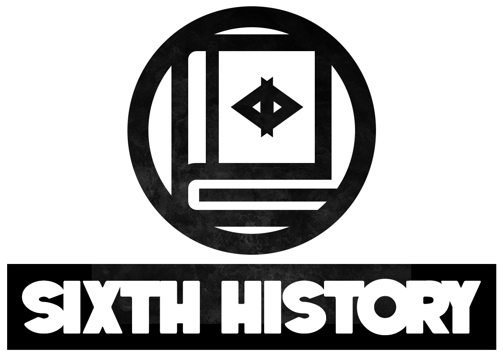
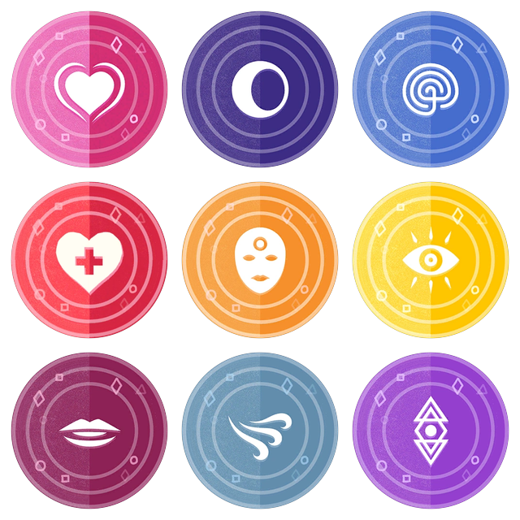
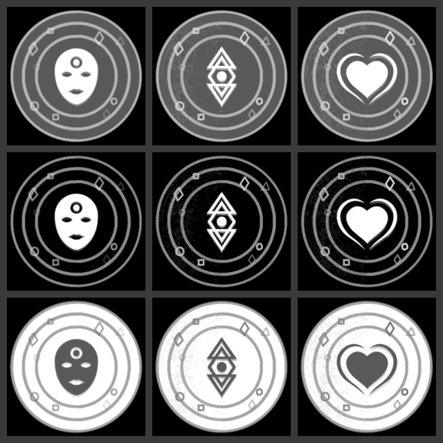

# BoH Elements of the Soul

> BoH Elements of the Soul is an independent work by Math-Man and is not affiliated with Weather Factory Ltd, Secret Histories or any related official content. It is published under Weather Factory's [Sixth History Community Licence](https://weatherfactory.biz/sixth-history-community-licence/).
>
> The source icons are from [Book of Hours](https://store.steampowered.com/app/1028310/BOOK_OF_HOURS/) by Weather Factory. This repository holds only converted versions of them, not the original assets. You can find out more and support Book of Hours at [weatherfactory.biz](https://weatherfactory.biz).

Icons of the elements of the soul from Book of Hours, converted to circular images with various heightmaps.

Heightmaps, one row each for the coin, relief and engraved profiles:

`badges/` holds the nine finished badges: 336×336 PNG, RGBA, 324px disc.

`heightmaps/<grain>/<profile>/` holds 16-bit heightmaps and matching normal maps, for the three profiles above and three grain treatments (`asis`, `mirrored`, `suppressed`). The light half of the original artwork carries a grain texture the dark half doesn't, so `mirrored` copies it across and `suppressed` removes it.

## Blender brushes

`Blender Brushes/` is a Blender asset library of nine sculpt brushes, one per icon, each stamping the `mirrored/coin` heightmap.

To install: **Preferences → Asset Libraries → Add new**, enter the path to `.../BoH-Elements-of-the-soul/Blender Brushes`, then **Save Preferences**. The brushes show up in the asset browser and the sculpt-mode asset shelf under the `Custom` catalog.

## Models

I've included the models I made under the Models folder, as a blender file. The badges use a multires modifier, so set the level you want and export an STL from it to print.

## Scripts

Need `numpy`, `pillow` and `scipy`.

- `python3 circularize.py <src_dir> <out_dir>` — squares to circular badges.
- `python3 depthmaps.py badges <out_dir>` — badges to the heightmaps and normal maps above.

## Why?

I love this game and wanted to 3d print the icons as badges, that's all :)

